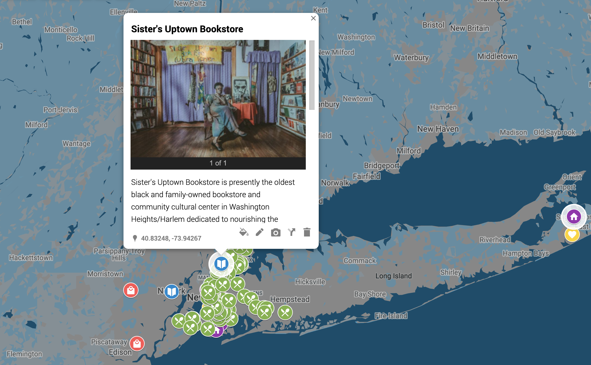

# The Buy Black Map
### Map of Black Owned Businesses (updated as of June 2020) primarily in New York City.

Compiled by Cara Michell from recent inventories on:

- [LitHub](https://lithub.com/you-can-order-today-from-these-black-owned-independent-bookstores/)
- [Vogue](https://vogue.com/article/55-black-owned-fashion-and-beauty-brands-to-support-now-and-always)
- [House Beautiful](https://housebeautiful.com/shopping/best-stores/g32729393/black-owned-home-businesses-to-support/)
- [Well and Good](https://wellandgood.com/good-advice/black-owned-wellness-brands/)
- [Black Owned Brooklyn](https://blackownedbrooklyn.com)
- [Official Black Wall Street](https://officialblackwallstreet.com)
- [Hannah Goldfield, Joseph Hernandex and Rachel Carten's spreadsheet](https://docs.google.com/spreadsheets/d/1jWcotmuutip9GP6MAyaiQ-DV_3NcV16BexZitzybc28/edit#gid=0)

Special Thanks to: John McCartin and Paul Christophe
